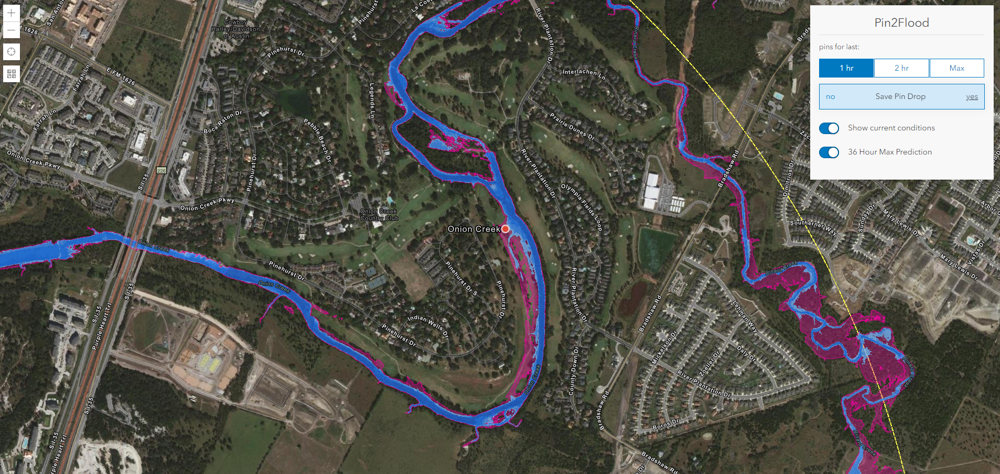

# Pin2Flood


[View it live](https://livingatlas.arcgis.com/labs/p2fv2/field)

## Prerequisites
Before we begin, make sure you have a fresh version of [Node.js](https://nodejs.org/en/) and NPM installed. The current Long Term Support (LTS) release is an ideal starting point. 

## Installing 
To begin, fork this repo and clone the fork to your computer:

```sh
https://github.com/vannizhang/Pin2Flood.git
```

From the project's root directory, install the required packages (dependencies):

```sh
npm install
```

## Running the app 
Now you can start the webpack dev server to test the app on your local machine:

```sh
# it will start a server instance and begin listening for connections from localhost on port 8080
npm run start
```

## Deployment
To build/deploye the app, you can simply run:

```sh
# it will place all files needed for deployment into the /build directory 
npm run build
```

## Use your own layers
Follow this [Instruction](./customization.md) to save `Pin Drops` and `Flood Polygon Results` to Hosted Feature Services managed by your own Organization.

## Resources
- [NFIE Services](https://flood.arcgis.com/arcgis/rest/services/NFIE)
- [National Water Model](https://livefeeds2.arcgis.com/arcgis/rest/services/NFIE)
- [ArcGIS Living Atlas of the World](https://livingatlas.arcgis.com/en/browse/#d=2&q=national%20water%20model)

## Issues

Find a bug or want to request a new feature?  Please let us know by submitting an issue.