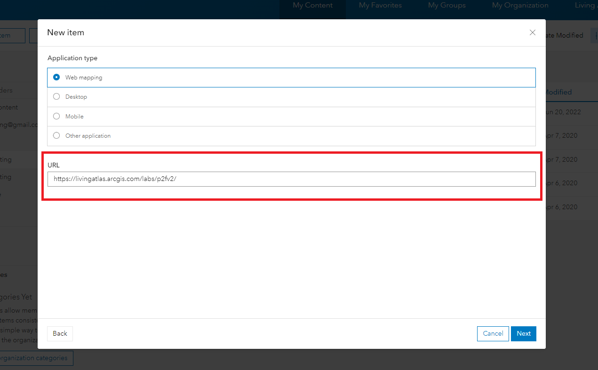
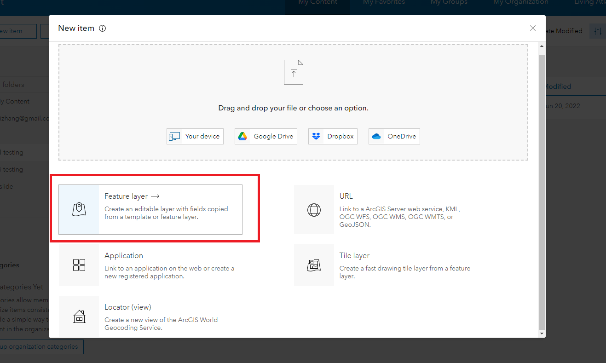
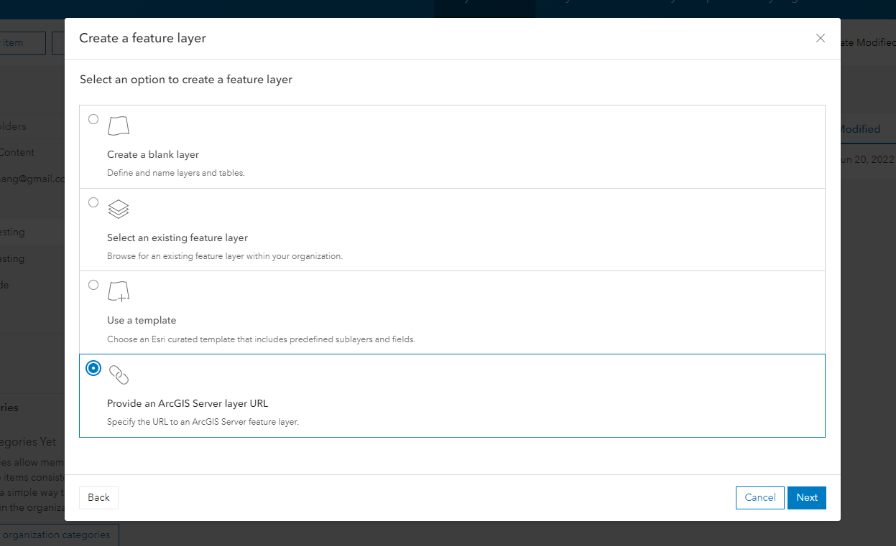

## How to save Pin Drops and Flood Polygon results to your own Hosted Feature Services

### Step 1 - Create an Application and Register it to generate the App ID:
The App ID will be used in the Pin2Flood app to allow users from your own organization to sign in to the Pin2Flood App. 

- Open "My Content" page and click the "New Item" button to create an Application

- For the "New Item" dialog, Use "https://livingatlas.arcgis.com/labs/p2fv2/" as Application's URL, after that, click "next" to continue.

- Provide a title (e.g. Pin2Flood App) and tags for this new item, then click on "Save" to create a new Application 

- Once the Application is created, go to the Settings page and scroll to the bottom to "App Registration" section and click the "Register" button.

- Add "https://livingatlas.arcgis.com/labs/p2fv2/" to list of Redirect URI and click Register.

- Now the Application is registered and you can use the **App ID** to authorize the Pin2Flood App (will show you how to use it in section below).

### Step 2 - Create Hosted Feature Layers: 

You also need to create two Hosted Feature Layers on ArcGIS Online that the Pin2Flood App can use to save the Pin Drop points and it's associated Pin2Flood polygons.

- Open "My Content" page and click the "New Item" button to create a feature layer

- Choose the "Provide an ArcGIS Server layer URL" option to create two feature layers using the URLs below (you can use default values for all other options):

    1. Feature Layer Template for Pin Drops:

        https://services.arcgis.com/jIL9msH9OI208GCb/arcgis/rest/services/flood_app_pin_drops/FeatureServer

    2. Feature Layer Template for Pin2Flood Polygons: 
        
        https://services.arcgis.com/jIL9msH9OI208GCb/arcgis/rest/services/Pin2Flood_Polygon_Template/FeatureServer

### Step 3: Create App's URL with your customized items in it:
To instruct the Pin2Flood app to use the App Id and items you created from previous steps, you will need to modify the URL below and replace the App ID (created in step 1) and Item IDs (created in step 2) with your own: 

`https://livingatlas.arcgis.com/labs/p2fv2/field/?appId={APP_ID_CREATED_FROM_STEP_1}&pindropsItemId={ITEM_ID_FOR_PIN_DROPS_LAYER}&floodPolygonsItemId={ITEM_ID_FOR_PIN2FLOOD_POLYGONS_LAYER}`

To do this, simply replace `{APP_ID_CREATED_FROM_STEP_1}` with the App ID that you created from Step 1; replace `{ITEM_ID_FOR_PIN_DROPS_LAYER}` with the item id of the feature layer that you created using the Pin Drops template; replace `{ITEM_ID_FOR_PIN2FLOOD_POLYGONS_LAYER}` with the item id of the feature layer that you created using the Pin2Flood Polygons template.

Now you can open the URL you just made and you should be able to start using your own Pin Drops and Flood Polygon Results layers in the Pin2Flood app.